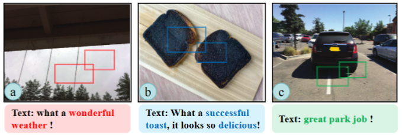

# MSD-GCN

  
😁This repository is the official codebase of "Multi-Modal Sarcasm Detection via Knowledge-aware Focused Graph Convolutional Networks"

## 🤡 Quickstart
📣For obtaining the data for the framework, please follow the steps:

1. First install the dependencies mentioned in the requirement.txt.
2. Second store the dataset according to the specified path. 
MMSD dataset [[Link]](https://github.com/headacheboy/data-of-multimodal-sarcasm-detection.git)	  
MMSD2.0 dataset [[Link]](https://github.com/JoeYing1019/MMSD2.0.git)  
4. Third download the pre-trained model(RoBERTa and Vit) and save the corresponding folder
5. Finally run main.py
